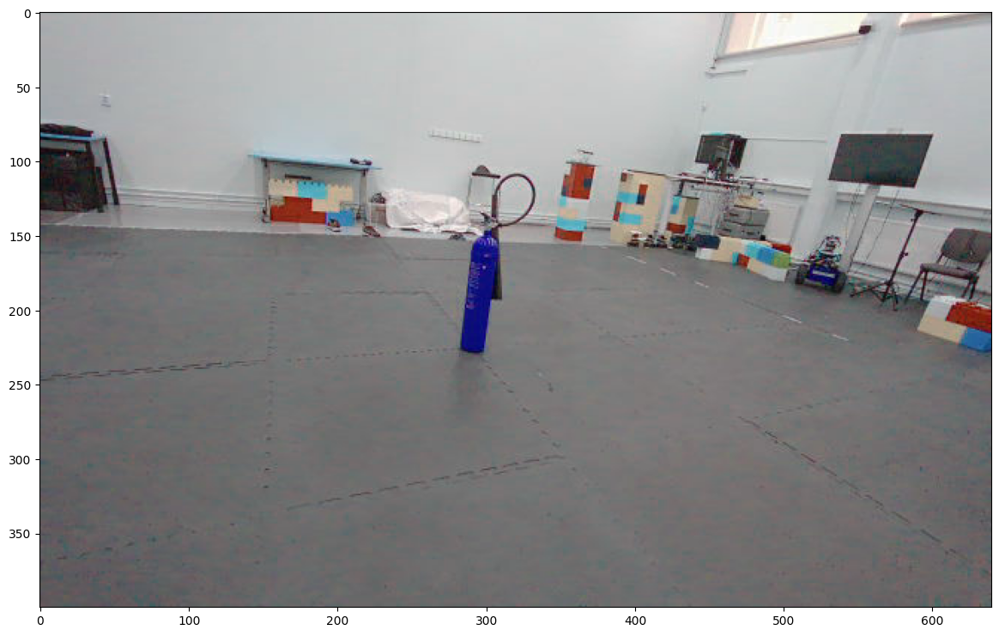

# Real-Time Object Detection, Decoy Filtering and Localization

Real-time object detection, decoy filtering and localization using YOLOv11, OpenCV and Faster R-CNN.


<p style="text-align: center"> Figure 1: Object detection, decoy filtering and 3D position estimation using Depth images</p>

# Index

1. Project Setup
2. Introduction to the Project
3. Object Detection
4. Decoy Filtering
5. Position Estimation
6. Discussion and Conclusion

# 1. Project Setup

For the setup of the project follow the instructions in the [SETUP.md](docs/SETUP.md) file.

## Project Structure

```bash
│
├── artifacts                 # folders excluded from the repo, what you store here it won't be store in the repo
│     ├── data
│     └── models
│
├── src                      # source code folder for common code and for CRISP-DM steps
│     ├── common
│     ├── faster_rcnn_experiment  # Faster R-CNN experiment      
│     └── yolo_v11_experiment     # YOLOv11 experiment
│
├── notebooks                 # jupyter notebooks folder
│
├── docs                      # documentation folder 
│     └── Project_Report.md   # final project report
│
├── dev-requirements.txt     # development dependencies
├── environment.yaml         # conda formatted dependencies, used by 'make init' to create the virtualenv
├── README.md                
└── requirements.txt         # core dependencies of the library in pip format
```


# 2. Introduction to the Project

The aim of this project is to develop a system capable of detecting fire extinguishers in images, distinguishing between real and decoy objects, and estimating the object's relative distance using depth information. The pipeline is composed of three components:

- Object Detection
- Decoy Filtering
- Position Estimation

# 3. Object Detection

## Dataset

Models were trained on the Roboflow [FireExtinguisher](https://universe.roboflow.com/fire-extinguisher/) dataset, which includes images of fire extinguishers among other objects. The models were trained using the YOLOv11 and Faster R-CNN architectures over 100 epochs.

## YOLOv11


<p style="text-align: center"> Figure 1: Original image in BGR Color Space</p>

The YOLOv11 model was employed to detect objects within the dataset, as illustrated below.


<p style="text-align: center"> Figure 2: Object Detection with YOLOv11</p>

The model successfully detected the fire extinguisher with a confidence probability of $0.7$.


<p style="text-align: center"> Figure 3: Fire Extinguisher Detection with YOLOv11</p>

Validation dataset results showed a precision of 92% and a recall of 85%.

|  Metrics  |  Value  |
| :-------: | :-----: |
| Precision | 92.137% |
|  Recall   | 85.076% |
<p style="text-align: center">Table 1: YOLOv11 Results</p>

## Faster R-CNN


<p style="text-align: center"> Figure 4: Fire Extinguisher Detection with Faster R-CNN</p>

The Faster R-CNN model was used to detect objects within the dataset, as illustrated above. The model successfully detected the fire extinguishers. 

|  Metrics  | Value  |
| :-------: | :----: |
| Precision | 61.55% |
|  Recall   | 95.38% |
<p style="text-align: center">Table 2: Faster R-CNN Results</p>

# 4. Decoy Filtering

Decoy filtering is achieved through two methodologies:
- Feature Extraction using ResNet18 and K-Means Clustering
- Local Binary Pattern histogram for Texture Analysis

## Feature Extraction using ResNet18 and K-Means Clustering

A pre-trained ResNet18 model extracts features from regions defined by bounding boxes in the images. These features are clustered using KMeans into two groups, effectively separating real fire extinguishers from decoys. The clustering results refine the bounding boxes to retain only those associated with real fire extinguishers.

 
<p style="text-align: center"> Figure 5: Object detection with Faster R-CNN before applying decoy filter</p>

The image above shows the Faster R-CNN model's detection results before applying the decoy filter.

 
<p style="text-align: center"> Figure 6: Object detection with Faster R-CNN after applying decoy filter using ResNet18 and K-Means</p>

The image above shows the Faster R-CNN model's detection results after applying the decoy filter.

## Local Binary Pattern histogram for Texture Analysis

The Local Binary Pattern (LBP) is a texture descriptor used to classify textures based on the patterns formed by pixel intensity values. The LBP histogram helps classify objects as real or decoys.


<p style="text-align: center"> Figure 7: LBP Histogram for Texture Analysis</p>

# 5. Position Estimation

Position estimation utilizes depth information from the image, obtained from a stereo camera's depth map. The depth map helps estimate the object's 3D position $(X,Y,Z)$ based on its 2D position $(x,y)$ and depth $D(x,y)$.

$$
\begin{align}
X = \frac{(x - c_x) * Z}{f_x} \\ \\
Y = \frac{(y - c_y) * Z}{f_y} \\ \\
Z = D(x,y) \\
\end{align}
$$

where:
- $(x,y)$ is the 2D position of the object in the image
- $(c_x, c_y)$ is the principal point of the camera
- $(f_x, f_y)$ is the focal length of the camera
- $D(x,y)$ is the depth at position $(x,y)$
- $(X,Y,Z)$ is the 3D position of the object

## Using Depth Map with YOLOv11


<p style="text-align: center"> Figure 8: Depth Map</p>

The depth map is used to estimate the 3D position of the object in the image.


<p style="text-align: center"> Figure 9: Object Detection with 3D Position Estimation</p>

The 3D position of the object is estimated using the depth map.

## Using Depth Map with Faster R-CNN

 
<p style="text-align: center"> Figure 11: 3D position estimated with Depth images</p>

# 6. Conclusion

- The trained YOLOv11 and Faster R-CNN models performed well on the validation dataset.
- YOLOv11 showed better precision, while Faster R-CNN had better recall.
- Decoy filtering using ResNet18 and KMeans clustering effectively distinguished real objects from decoys.
- Depth camera parameters and depth images were utilized to estimate the 3D position of detected objects. 

Future improvements could include:

- Image rectification
- Fine-tuning texture analysis thresholds
- Investigating depth camera scale for better visualization.
- Integration with ROS could automate processes and enhance scene understanding.
