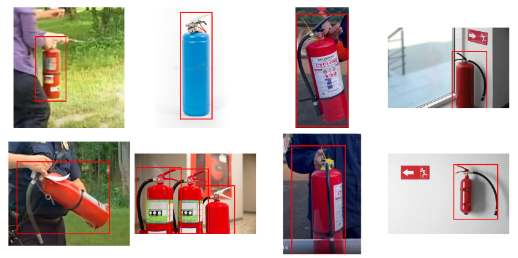
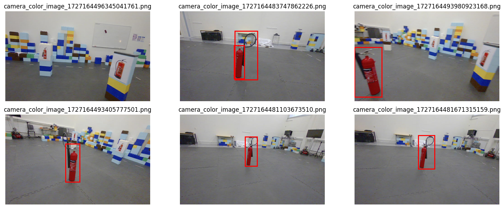

<h1 style="text-align: center"> R7020E Final Project </h1>

 Group 6

 Jose Juan Pena Gomez (jospen-3)

 Sushanta Mohapatra (susmoh-3)

 31 October 2024

# Index

1. Introduction
2. Object Detection
3. Decoy Filtering
4. Position Estimation
5. Conclusion

# Introduction

The aim of this project is to develop a system that can detect objects in a given image, classify if it's a decoy object and then estimate the relative distance of the object given the depth. The system is divided into three main components: 

- Object Detection
- Decoy Filtering
- Position Estimation

# Object Detection

Models were trained on the Roboflow [FireExtinguiser](https://universe.roboflow.com/fire-extinguisher/) dataset. The dataset consists of images of fire extinguishers and other objects. The model was trained using the YOLOv11 architecture. The model was trained for 100 epochs on a single NVIDIA RTX 2080 Ti GPU. 

Models trained were:
- Faster R-CNN
- YOLOv11

## YOLOv11

 Figure 1: Original image

Using the YOLOv11 model, the object detection was done on the dataset provided using this image to illustrate the results.

 Figure 2: Object Detection with YOLOv11

The model was able to detect the fire extinguisher in the image with a confidence probability of $0.7$.

 Figure 3: Fire Extinguisher Detection with YOLOv11

These are some of the results using the validation dataset, where the accuracy 92%

|  Metrics  |  Value  |
| :-------: | :-----: |
| Precision | 92.137% |
|  Recall   | 85.076% |

Table 1: Yolov11 Results

 
## Faster R-CNN

 Figure 4: Fire Extinguisher Detection with Faster R-CNN

|  Metrics  | Value  |
| :-------: | :----: |
| Precision | 61.55% |
|  Recall   | 95.38% |

Table 2: Faster R-CNN Results

# Decoy Filtering

The decoy filtering is done using two methods:
- Feature Extraction using ResNet18 and K-Means Clustering
- Local Binary Pattern histogram for Texture Analysis

## Feature Extraction using ResNet18 and K-Means Clustering

To filter out decoy objects and identify real fire extinguishers, we used a pre-trained ResNet18 model to extract features from the regions defined by bounding boxes in the images. These features are then clustered into two groups using the KMeans algorithm, which separates the real fire extinguishers from decoys. The clustering results are used to filter the bounding boxes, retaining only those associated with the cluster identified as containing real fire extinguishers. 

 

 Figure 5: Object detection with faster r-cnn before applying decoy filter

 

 Figure 6: Object detection with faster r-cnn and applying decoy filter using ResNet18 and K-Means

## Local Binary Pattern histogram for Texture Analysis

The Local Binary Pattern (LBP) is a texture descriptor that is used to classify textures based on the patterns formed by the intensity values of the pixels in an image. 
The LBP histogram is used to classify the object as a decoy or not.

 Figure 7: LBP Histogram for Texture Analysis

# Position Estimation

The position estimation is done using the depth information from the image. The depth information is obtained using the depth map generated from the stereo camera. 
The depth map is used to estimate the relative position in 3D $(X,Y,Z)$ based in the 2D position $(x,y)$ of the object in the image and the depth $D(x,y)$.

$$
\begin{align}
X = \frac{(x - c_x) * Z}{f_x} \\ \\
Y = \frac{(y - c_y) * Z}{f_y} \\ \\
Z = D(x,y) \\
\end{align}
$$

where:
- $(x,y)$ is the 2D position of the object in the image
- $(c_x, c_y)$ is the principal point of the camera
- $(f_x, f_y)$ is the focal length of the camera
- $D(x,y)$ is the depth of the object at position $(x,y)$
- $(X,Y,Z)$ is the 3D position of the object
- $Z$ is the depth of the object
- $X$ is the relative position in the x-axis
- $Y$ is the relative position in the y-axis

## Using Depth Map with YoloV11

 Figure 8: Depth Map

The depth map is used to estimate the 3D position of the object in the image.

 Figure 9: 3D Position Estimation using Depth Map

The 3D position of the object is estimated using the depth map.

## Using Depth Map with Faster r-cnn

 

 Figure 10: 3D position estimated with Depth images

# Discussion and Conclusion
- The trained Yolov11 and Faster R-CNN performed farely well when tested with validation dataset of fire-extinguisher dataset
- YoloV11 imlementation showed better precision and Faster R-CNN implementation showed better recall
- Implementing a decoy filtering mechanism using feature extraction with ResNet18 and KMeans clustering effectively distinguished real objects from decoys
- Depth camera paramets and depth information from depth images were used to estimate 3D position of detected real objects
- We missed to rectify the images
- We could have fine tune better the threshold for the texture analysis
- We could have improve the 3D real position by investigating the scale the depth camera and of the point clouds to have better visualizations
- Use ROS to automate part of the process and better understand the scene
